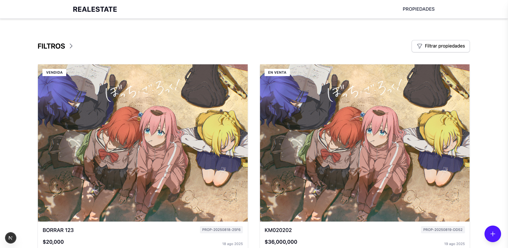

# RealEstate_Front

Este proyecto es una aplicación web frontend para una plataforma de listado de propiedades inmobiliarias. Está construida con Next.js, React y TypeScript, utilizando Tailwind CSS para el estilizado y Jest para las pruebas unitarias.

## Descripción del Proyecto

La aplicación permite a los usuarios visualizar, filtrar, crear y editar listados de propiedades. Está diseñada para ser una interfaz de usuario intuitiva y responsiva, conectándose a una API de backend (no incluida en este repositorio) para la gestión de datos.

## Características Principales

*   **Visualización de Propiedades**: Muestra una cuadrícula de propiedades disponibles con información clave.
*   **Detalle de Propiedad**: Vista detallada de una propiedad específica, incluyendo toda su información.
*   **Filtrado de Propiedades**: Permite a los usuarios buscar y filtrar propiedades según diversos criterios.
*   **Creación de Propiedades**: Formulario para añadir nuevas propiedades a la plataforma.
*   **Edición de Propiedades**: Funcionalidad para modificar la información de propiedades existentes.
*   **Navegación**: Barra de navegación para moverse entre las diferentes secciones de la aplicación.

## Tecnologías Utilizadas

*   **Next.js**: Framework de React para aplicaciones web con renderizado del lado del servidor y generación de sitios estáticos.
*   **React**: Biblioteca de JavaScript para construir interfaces de usuario.
*   **TypeScript**: Superset de JavaScript que añade tipado estático.
*   **Tailwind CSS**: Framework CSS de primera utilidad para un estilizado rápido y personalizado.
*   **Jest**: Framework de pruebas de JavaScript para pruebas unitarias y de integración.
*   **React Testing Library**: Utilidades para probar componentes de React de una manera que se asemeja a cómo los usuarios interactuarían con ellos.

## Requisitos Previos

Asegúrate de tener instalado lo siguiente en tu sistema:

*   **Node.js**: Versión 18.x o superior. Puedes descargarlo desde [nodejs.org](https://nodejs.org/).
*   **npm** (viene con Node.js) o **Yarn**.

## Instalación

Sigue estos pasos para configurar el proyecto en tu máquina local:

1.  **Clona el repositorio**:

    ```bash
    git clone <URL_DEL_REPOSITORIO>
    cd realestate
    ```

2.  **Instala las dependencias**:

    ```bash
    npm install
    # o si usas yarn
    # yarn install
    ```

## Ejecución del Proyecto

### Modo Desarrollo

Para iniciar la aplicación en modo desarrollo con recarga en caliente:

```bash
npm run dev
# o
# yarn dev
```

La aplicación estará disponible en `http://localhost:3000`.

### Construcción para Producción

Para construir la aplicación para producción:

```bash
npm run build
# o
# yarn build
```

Esto creará una carpeta `.next` con los archivos optimizados para producción.

### Iniciar en Modo Producción

Después de construir la aplicación, puedes iniciar el servidor de producción:

```bash
npm run start
# o
# yarn start
```

## Ejecución de Tests

Este proyecto utiliza Jest y React Testing Library para las pruebas. Los archivos de prueba se encuentran en la carpeta `__tests__/`.

Para ejecutar todos los tests:

```bash
npm test
# o
# yarn test
```

Para ejecutar los tests en modo `watch` (observa los cambios en los archivos y vuelve a ejecutar los tests afectados):

```bash
npm test -- --watch
# o
# yarn test --watch
```

## Estructura del Proyecto

Aquí se describe la estructura principal de directorios y archivos del proyecto:

```
realestate/
├── .next/                  # Archivos de construcción de Next.js (generados)
├── node_modules/           # Dependencias del proyecto (generadas)
├── public/                 # Archivos estáticos (imágenes, iconos, etc.)
│   ├── file.svg
│   ├── globe.svg
│   ├── next.svg
│   ├── vercel.svg
│   └── window.svg
├── src/
│   ├── features/           # Módulos de características específicas de la aplicación
│   │   └── properties/     # Módulo de propiedades
│   │       ├── api.ts      # Funciones para interactuar con la API de propiedades
│   │       ├── types.ts    # Definiciones de tipos para propiedades
│   │       └── components/ # Componentes relacionados con propiedades
│   │           ├── PropertiesGrid.tsx
│   │           ├── PropertyCard.tsx
│   │           ├── PropertyDetail.tsx
│   │           ├── PropertyEditModal.tsx
│   │           ├── PropertyFilters.tsx
│   │           └── PropertyFormModal.tsx
│   ├── pages/              # Páginas de Next.js (rutas de la aplicación)
│   │   ├── _app.tsx        # Componente raíz de la aplicación
│   │   └── properties/     # Páginas relacionadas con propiedades
│   │       ├── index.tsx   # Página principal de listado de propiedades
│   │       └── detail/     # Página de detalle de propiedad
│   │           └── [id].tsx # Ruta dinámica para el detalle de una propiedad
│   ├── shared/             # Componentes y utilidades compartidas
│   │   └── components/
│   │       ├── FloatingCreateButton.tsx
│   │       └── Navbar.tsx
│   └── styles/             # Estilos globales y de Tailwind CSS
│       └── globals.css
├── __tests__/
│   └── features/
│       └── properties/
│           └── components/ # Tests para los componentes de propiedades
│               ├── PropertiesGrid.test.tsx
│               ├── PropertyCard.test.tsx
│               ├── PropertyDetail.test.tsx
│               ├── PropertyEditModal.test.tsx
│               ├── PropertyFilters.test.tsx
│               └── PropertyFormModal.test.tsx
├── .gitignore              # Archivos y directorios ignorados por Git
├── babel.config.js         # Configuración de Babel
├── eslint.config.mjs       # Configuración de ESLint
├── jest.config.js          # Configuración de Jest
├── jest.setup.ts           # Archivo de configuración de Jest para setup
├── next.config.ts          # Configuración de Next.js
├── package-lock.json       # Bloqueo de versiones de dependencias (npm)
├── package.json            # Metadatos del proyecto y scripts
├── postcss.config.mjs      # Configuración de PostCSS
├── README.md               # Este archivo
├── tailwind.config.js      # Configuración de Tailwind CSS
└── tsconfig.json           # Configuración de TypeScript
```

## Scripts Disponibles

En el archivo `package.json`, puedes encontrar los siguientes scripts útiles:

*   `dev`: Inicia la aplicación en modo desarrollo.
*   `build`: Compila la aplicación para producción.
*   `start`: Inicia el servidor de producción después de la compilación.
*   `lint`: Ejecuta ESLint para analizar el código en busca de errores y problemas de estilo.
*   `test`: Ejecuta todos los tests con Jest.

---

### `preview page`



¡Esperamos que esta guía te sea útil para entender y trabajar con el proyecto!